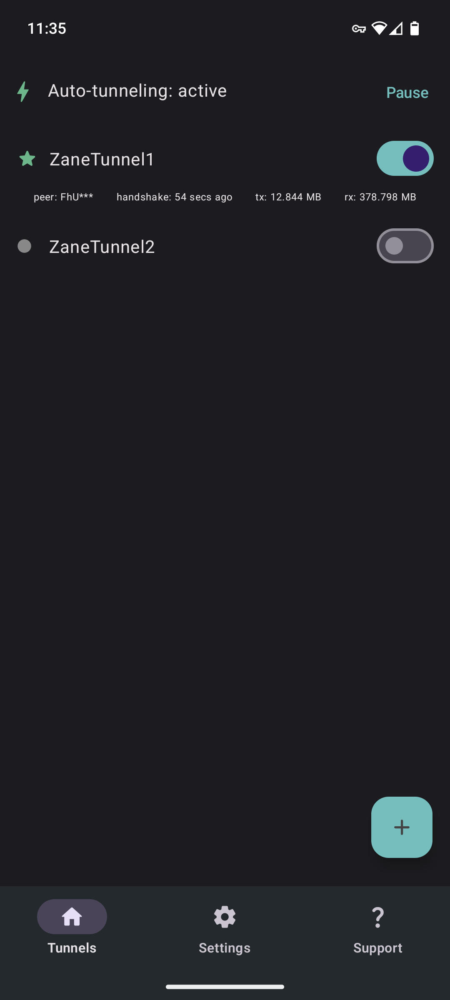
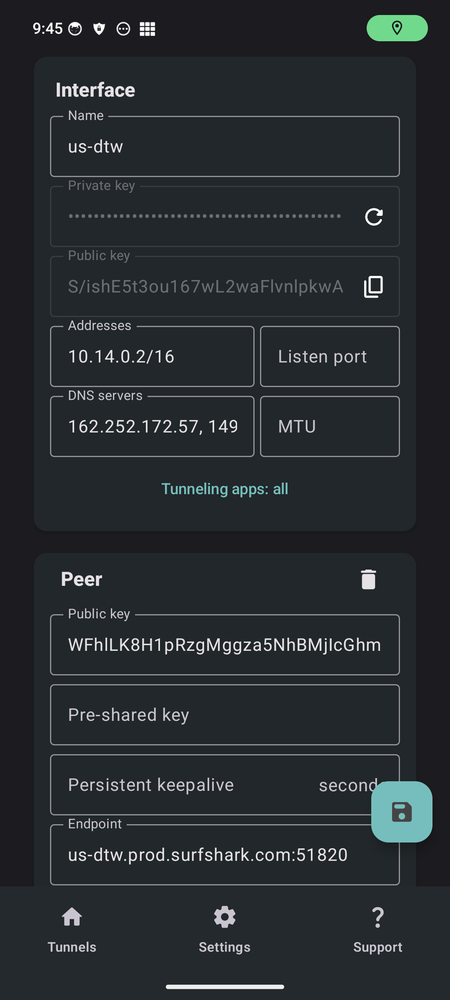
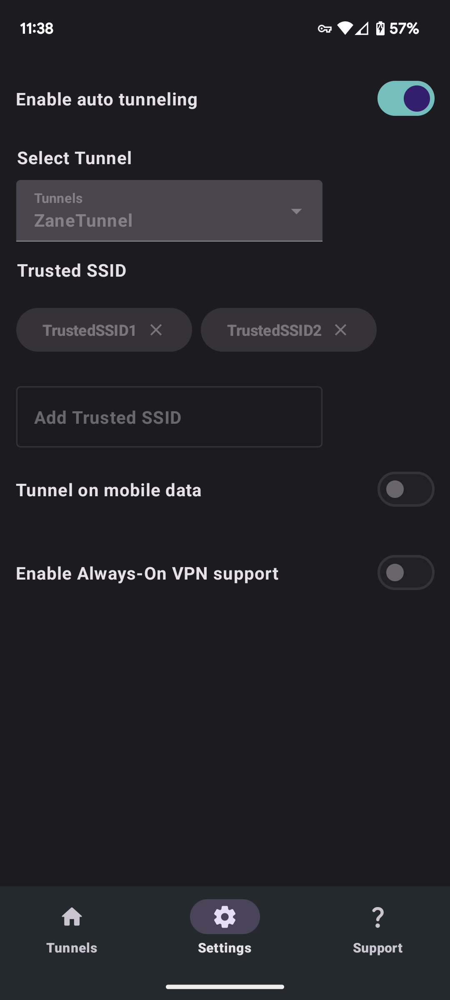
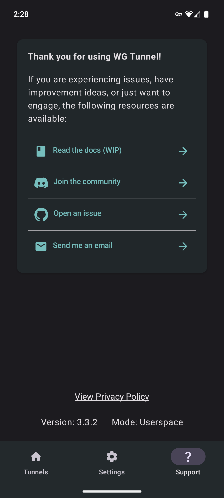

<h1 align="center">
WG Tunnel
</h1>

<div align="center">

[](https://discord.gg/rbRRNh6H7V)
[](https://twitter.com/i/communities/1780655267685736818)
[](https://t.me/wgtunnel)

</div>

<div align="center">


[](https://play.google.com/store/apps/details?id=com.zaneschepke.wireguardautotunnel)
[](https://f-droid.org/packages/com.zaneschepke.wireguardautotunnel/)


</div>


<div align="left">

This is an alternative Android Application for [WireGuard](https://www.wireguard.com/)
and [AmneziaWG](https://docs.amnezia.org/documentation/amnezia-wg/) with added
features. Built using the [wireguard-android](https://github.com/WireGuard/wireguard-android)
library and [Jetpack Compose](https://developer.android.com/jetpack/compose), this application was
inspired by the official [WireGuard Android](https://github.com/WireGuard/wireguard-android) app.

</div>

<div align="center">

## Screenshots

<p float="center">
  
  
  
  
</p>

<div align="left">

## Inspiration

The original inspiration for this app came from the inconvenience of having to manually turn VPN off
and on while on different networks. This app was created to offer a free solution to this problem.

## Features

* Add tunnels via .conf file, zip, manual entry, or QR code
* Auto connect to tunnels based on Wi-Fi SSID, ethernet, or mobile data
* Split tunneling by application with search
* WireGuard support for kernel and userspace modes
* Amnezia support for userspace mode for DPI/censorship protection
* Always-On VPN support
* Export Amnezia and WireGuard tunnels to zip
* Quick tile support for tunnel toggling, auto-tunneling
* Static shortcuts support for tunnel toggling, auto-tunneling
* Intent automation support for all tunnels
* Automatic auto-tunneling service restart after reboot
* Automatic tunnel restart after reboot
* Battery preservation measures
* Restart tunnel on ping failure (beta)

## Fdroid

Want updates faster?

Check out my personal [fdroid repository](https://github.com/zaneschepke/fdroid) to get updates the
moment they are released.

## Docs

Information about features, behaviors, and answers to common questions can be found in the
app [documentation](https://zaneschepke.com/wgtunnel-docs/overview.html).

The repository for these docs can be found [here](https://github.com/zaneschepke/wgtunnel-docs).

## Translation

This app is using [Weblate](https://weblate.org) to assist with translations.

Help translate WG Tunnel into your language
at [Hosted Weblate](https://hosted.weblate.org/engage/wg-tunnel/).\
[](https://hosted.weblate.org/engage/wg-tunnel/)

## Building

```
$ git clone https://github.com/zaneschepke/wgtunnel
$ cd wgtunnel
```

And then build the app:

```
$ ./gradlew assembleDebug
```

## Contributing

Any contributions in the form of feedback, issues, code, or translations are welcome and much
appreciated!

Please read
the [code of conduct](https://github.com/zaneschepke/wgtunnel?tab=coc-ov-file#contributor-code-of-conduct)
before contributing.
