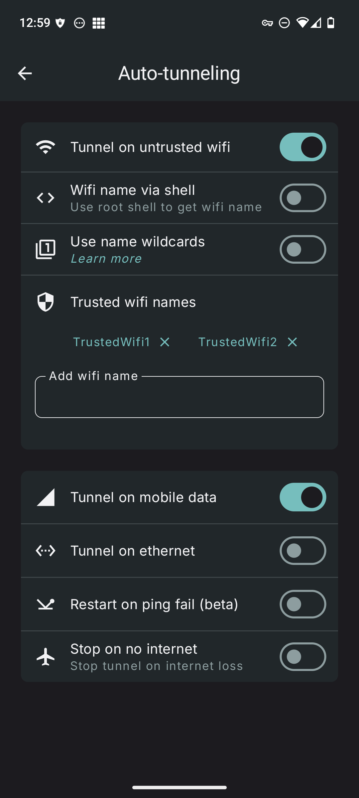

<h1 align="center">
WG Tunnel
</h1>

<div align="center">

  An alternative Android client app for [WireGuard®](https://www.wireguard.com/)
and [AmneziaWG](https://docs.amnezia.org/documentation/amnezia-wg/)
  <br />
  <br />
  <a href="https://github.com/zaneschepke/wgtunnel/issues/new?assignees=zaneschepke&labels=bug&projects=&template=bug_report.md&title=%5BBUG%5D+-+Problem+with+app">Report a Bug</a>
  ·
  <a href="https://github.com/zaneschepke/wgtunnel/issues/new?assignees=zaneschepke&labels=enhancement&projects=&template=feature_request.md&title=%5BFEATURE%5D+-+New+feature+request">Request a Feature</a>
  ·
  <a href="https://github.com/zaneschepke/wgtunnel/discussions">Ask a Question</a>

</div>

<br/>

<div align="center">

[](https://play.google.com/store/apps/details?id=com.zaneschepke.wireguardautotunnel)
[](https://f-droid.org/packages/com.zaneschepke.wireguardautotunnel/)
[](https://github.com/zaneschepke/fdroid)

</div>

<div align="center">

[](https://discord.gg/rbRRNh6H7V)
[](https://t.me/wgtunnel)

</div>

<details open="open">
<summary>Table of Contents</summary>

- [About](#about)
- [Acknowledgements](#acknowledgements)
- [Screenshots](#screenshots)
- [Features](#features)
- [Building](#building)
- [Translation](#translation)
- [Contributing](#contributing)

</details>

<div style="text-align: left;">

## About
Inspired by the official [wireguard-android](https://github.com/WireGuard/wireguard-android) app, WG Tunnel was created to address features and support missing from the official app. This app combines support for both [WireGuard®](https://www.wireguard.com/)
and [AmneziaWG](https://docs.amnezia.org/documentation/amnezia-wg/), with its primary feature of auto-tunneling (on-demand tunneling).

</div>

<div style="text-align: left;">

## Acknowledgements

Thank you to the following:

- All of the users that have helped contribute to the project with ideas, translations, feedback, bug reports, testing, and donations.
- [WireGuard®](https://www.wireguard.com/) - © Jason A. Donenfeld (https://github.com/WireGuard/wireguard-android)

- [AmneziaWG](https://docs.amnezia.org/documentation/amnezia-wg/) - Amnezia Team (https://github.com/amnezia-vpn/amneziawg-android)

## Screenshots

</div>
<div style="display: flex; flex-wrap: wrap; justify-content: center; gap: 10px;">
 
 
  
  
</div>

<div style="text-align: left;">

## Features

* Add tunnels via .conf file, zip, manual entry, clipboard, or QR code
* Auto-tunnel based on Wi-Fi SSID, ethernet, or mobile data
* Split tunneling by application with search
* Support for kernel and userspace modes
* Amnezia support for userspace mode for DPI/censorship protection
* Pre/Post Up/Down scripts support for all modes on a rooted device
* Always-On VPN support
* Export tunnels to zip
* Quick tile support for tunnel toggling, auto-tunneling
* Shortcuts support for tunnel toggling, auto-tunneling
* Intent automation support for all tunnels
* In app VPN kill switch with LAN bypass
* Automatic auto-tunneling service and/or tunnel restart after reboot or app update
* Battery preservation measures
* Restart tunnel on ping failure

## Building

```sh
git clone https://github.com/zaneschepke/wgtunnel
cd wgtunnel
```

```sh
./gradlew assembleDebug
```

## Translation

This app is using [Weblate](https://weblate.org) to assist with translations.

Help translate WG Tunnel into your language
at [Hosted Weblate](https://hosted.weblate.org/engage/wg-tunnel/).\
[](https://hosted.weblate.org/engage/wg-tunnel/)

## Contributing

Any contributions in the form of feedback, issues, code, or translations are welcome and much
appreciated!

Please read
the [code of conduct](https://github.com/zaneschepke/wgtunnel?tab=coc-ov-file#contributor-code-of-conduct)
before contributing.
