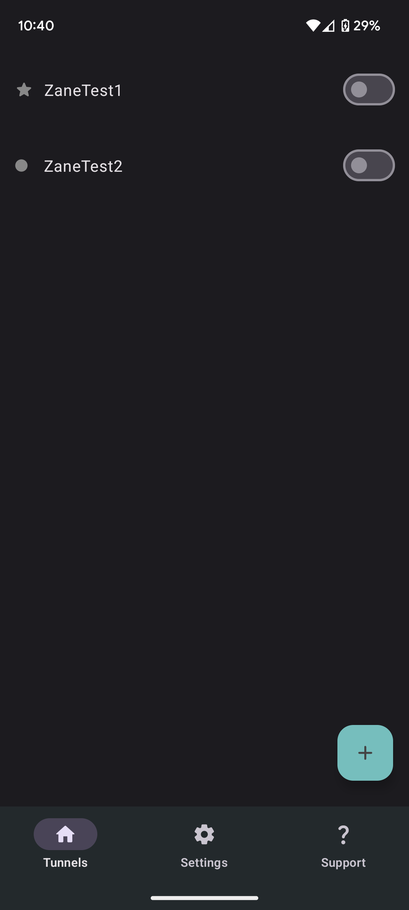
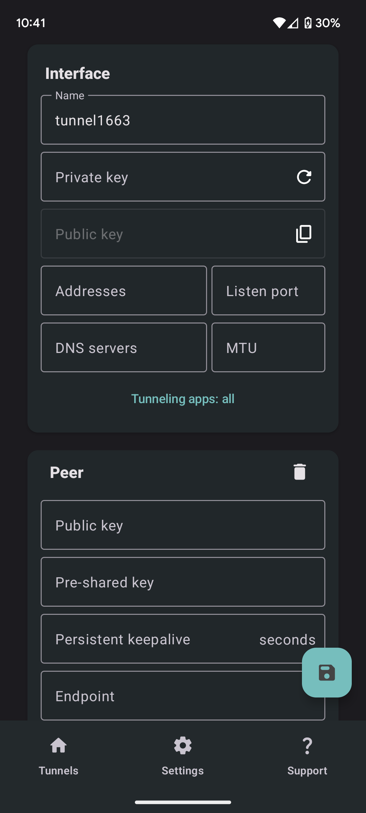
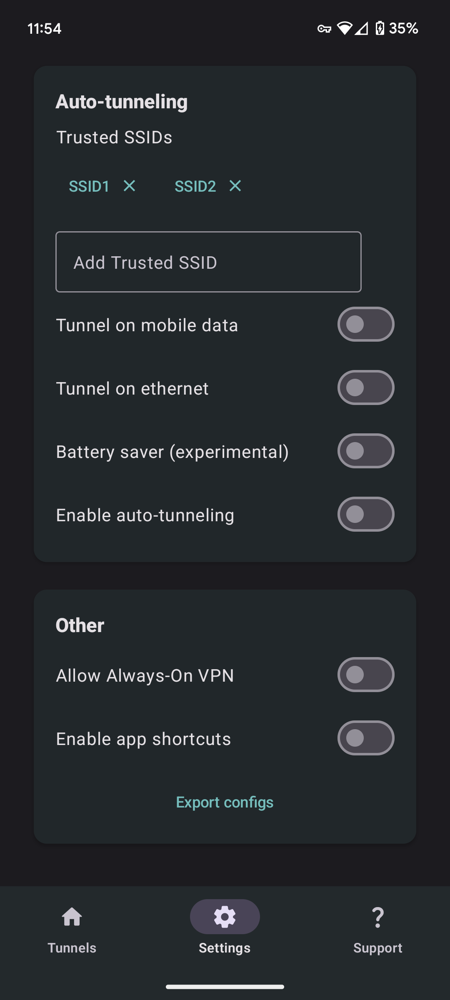
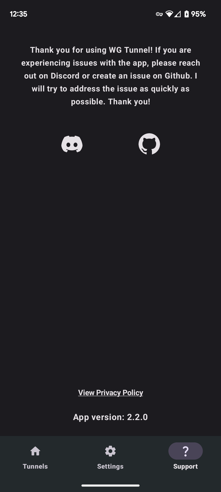

<h1 align="center">
WG Tunnel
</h1>

<span align="center">

[](https://opensource.org/licenses/MIT)
[](https://discord.gg/rbRRNh6H7V)

</span>

<span align="center">


[](https://play.google.com/store/apps/details?id=com.zaneschepke.wireguardautotunnel)

</span>

<span align="left">

This is an alternative Android Application for [WireGuard](https://www.wireguard.com/) with added features. Built using the [wireguard-android](https://github.com/WireGuard/wireguard-android) library and [Jetpack Compose](https://developer.android.com/jetpack/compose), this application was inspired by the official [WireGuard Android](https://github.com/WireGuard/wireguard-android) app.

</span>

<span align="center">

## Screenshots

<p float="center">
  
  
  
  
</p>

<span align="left">

## Inspiration

The inspiration for this app came from the inconvenience of constantly having to turn VPN off and on while on different networks. With there being no free solution to this problem, this app was created to meet that need.

## Features

* Add tunnels via .conf file
* Auto connect to VPN based on Wi-Fi SSID
* Split tunneling by application
* Configurable Trusted Network list 
* Optional auto connect on mobile data
* Automatic service restart after reboot
* Service will stay running in background after app has been closed


## Building
    
```
$ git clone https://github.com/zaneschepke/wgtunnel
$ cd wgtunnel
$ ./gradlew assembleRelease
```

</span>
